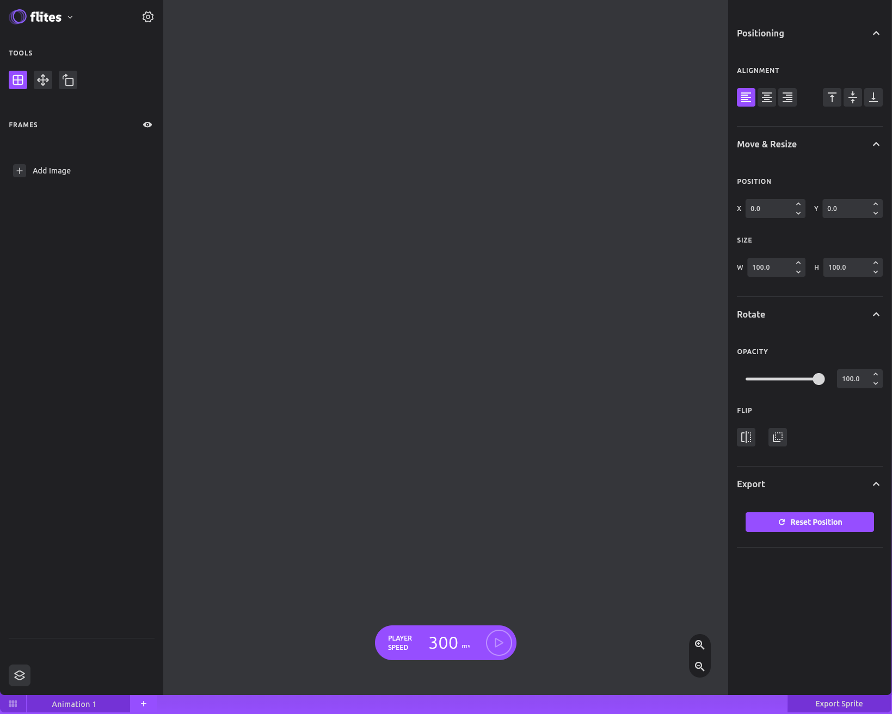
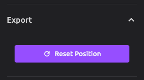
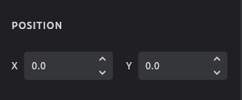
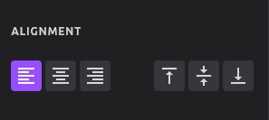
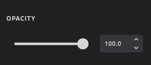
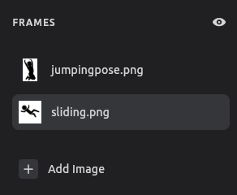

# UI Library Documentation

## Introduction

Flites UI Library provides a collection of reusable components designed for building consistent and accessible user interfaces. The library offers a structured approach to constructing panels, controls, and inputs that match the application's design language.

The UI components are organized hierarchically, starting with layout components like `AppShell` down to specific input controls. This modular approach allows for flexible composition of interfaces while maintaining consistency across the application.

## Form Management

Flites provides a powerful form management system for panel controls through the `PanelForm` widget. This allows for centralized state management, simplified data collection, and streamlined form submission.

For comprehensive documentation on how to create and work with forms in panels, see the [Panel Forms documentation](./panel-forms.md).

### Key Features

- Centralized state management for form controls
- Automatic value tracking across multiple panel controls
- Form submission and validation handling
- Support for conditional form fields

### Example Usage

```dart
PanelForm(
  initialValues: {'format': 'png'},
  onSubmit: (values) {
    // Process form data
  },
  child: Column(
    children: [
      PanelSelectInput<String>(
        label: 'Format',
        formKey: 'format', // Links this control to the form
        options: [
          SelectInputOption(label: 'PNG', value: 'png'),
          SelectInputOption(label: 'JPEG', value: 'jpg'),
        ],
      ),
      // Other form controls...
    ],
  ),
)
```

All panel controls support the `formKey` property to integrate with forms. When using a `formKey`, the `onChanged` callbacks become optional.

## App Shell

The `AppShell` is the main layout container that organizes the application's interface with optional left and right panels, with the main content in the center.



### Usage

```dart
    AppShell(
      panelLeft: YourLeftPanelWidget(),
      panelRight: YourRightPanelWidget(),
      child: YourMainContentWidget(), 
    )
```

### Example

```dart
    AppShell(
      panelLeft: const ProjectFileListVertical(),
      panelRight: const PanelPositioningControls(),
      child: const YourCanvas(),
    )
```

## Panel

The `Panel` component is a container that appears on either the left or right side of the application. It's designed to hold controls, lists, and other UI elements that support the main content area.

### Properties

- `children`: List of widgets to display in the panel
- `position`: The position of the panel (`PanelPosition.left` or `PanelPosition.right`)
- `isScrollable`: Whether the panel content should be scrollable

### Usage of AppShell

```dart
    Panel(
      position: PanelPosition.right,
      isScrollable: true,
      children: [
        // Your panel content
      ],
    )
```

### Examples

#### Left Panel (Project File List)

```dart
    Panel(
      position: PanelPosition.left,
      isScrollable: false,
      children: [
        Flexible(flex: 0, child: MainBrand()),
        gapH8,
        Flexible(flex: 0, child: MainToolBox()),
        Expanded(child: MainFrameList()),
        gapH32,
        Flexible(
          flex: 0,
          child: Padding(
            padding: EdgeInsets.all(Sizes.p16),
            child: Row(
              children: [
                CanvasControlsButton(),
              ],
            ),
          ),
        ),
      ],
    )
```

#### Right Panel (Positioning Controls)

```dart
    Panel(
      children: [
        gapH32,
        
        // Panel sections and controls...
        
        PanelSection(
          label: 'Export',
          children: [
            PanelButton(
              label: 'Reset Position',
              icon: Icons.refresh,
              onPressed: () {
                // Reset action
              },
            ),
          ],
        ),
      ],
    )
```

## Panel Structure Elements

These components help organize content within a panel into logical sections.

### PanelSection Overview

`PanelSection` groups related controls together under a common heading.



#### PanelSection Properties

- `label`: The section heading text
- `children`: Widgets to display in the section

#### PanelSection Usage

```dart
    PanelSection(
      label: 'Section Name',
      children: [
        // Section content
      ],
    )
```

### PanelControlWrapper Overview

`PanelControlWrapper` organizes controls in a row layout with a label, useful for related inputs like 2-3 inputs next to each other.



**PanelControlWrapper Properties:**

- `label`: The wrapper label text.
- `children`: Controls to display in the wrapper.
- `alignment`: The alignment of the controls within the wrapper.
- `layout`: Defines how much space each child takes up.
- `controls`: Optional controls to display at the top of the control wrapper.
- `helpText`: A string that provides additional information about the control. This is displayed as a tooltip when hovering over a small question mark icon next to the label.

**PanelControlWrapper Usage:**

```dart
PanelControlWrapper(
  label: 'Position',
  helpText: 'Adjust the position of the element',
  children: [
    NumberInput(label: 'X', value: xValue, onChanged: onXChanged),
    NumberInput(label: 'Y', value: yValue, onChanged: onYChanged),
  ],
)
```

**HelpText Explanation:**

The `helpText` property allows you to provide additional context or guidance for the controls within the `PanelControlWrapper`. When specified, a small question mark icon appears next to the label. Hovering over this icon displays the help text as a tooltip.

### Panel Components Overview

1. **PanelSelectInput Details**

   - `options`: List of `SelectInputOption<T>` objects that define the available choices.
   - `value`: The currently selected value for single selection mode.
   - `selectedValues`: List of currently selected values for multiple selection mode.
   - `onChanged`: Optional callback function for single selection mode.
   - `onMultiChanged`: Optional callback function for multiple selection mode.
   - `label`: The label text for the control.
   - `helpText`: Optional help text to display below the control.
   - `multiple`: Boolean flag that determines whether to use single or multiple selection mode.
   - `formKey`: Optional identifier for use with `PanelForm`.
   - `prefix`, `suffix`, `prefixWidget`, `postfixWidget`: Optional properties passed to the underlying input component.

2. **PanelCheckboxInput Details**

   - `value`: Boolean indicating whether the checkbox is checked.
   - `onChanged`: Callback function that's called when the checkbox is toggled.
   - `label`: The label text for the control.
   - `checkboxLabel`: Optional text to display next to the checkbox itself.
   - `helpText`: Optional help text to display below the control.
   - `formKey`: Optional identifier for use with `PanelForm`.

3. **PanelRadioInput Details**

   - `options`: List of `RadioInputOption<T>` objects that define the available choices.
   - `selectedValue`: The currently selected value.
   - `onChanged`: Callback function that's called when the user selects a different option.
   - `label`: The label text for the control.
   - `helpText`: Optional help text to display below the control.
   - `direction`: The layout direction of the radio buttons (`Axis.horizontal` or `Axis.vertical`).
   - `formKey`: Optional identifier for use with `PanelForm`.

4. **PanelIconButton Details**

   - `icon`: The icon to display.
   - `tooltip`: Tooltip text.
   - `isSelected`: Whether the button is in selected state.
   - `onPressed`: Callback for when the button is pressed.
   - `value`: Optional value for the button.

5. **PanelIconBtnGroup Details**

   - `label`: The group label text.
   - `controls`: Primary list of icon buttons.
   - `additionalControls`: Optional secondary list of icon buttons.
   - `selectedValues`: List of currently selected values.
   - `spacing`: Spacing between buttons (`PanelIconBtnSpacing.compact` or `PanelIconBtnSpacing.large`).
   - `onControlSelected`: Callback for when a button is selected.
   - `helpText`: Optional help text to display below the control.

6. **PanelList Details**

   - `items`: A list of data items that will be displayed in the panel list.
   - `onItemTap`: Callback for when an item is tapped.
   - `selectedValues`: List of currently selected values.
   - `multiSelect`: Whether multiple selections are allowed.
   - `leadingWidget`: Optional widget to display at the start of the list.
   - `trailingWidget`: Optional widget to display at the end of the list.
   - `onReorder`: Callback for when items are reordered.
   - `scrollController`: Controller for the list's scrollable content.
   - `sectionLabelControls`: Optional controls to display in the section label.
   - `helpText`: Optional help text to display below the control.

7. **PanelNumberInput Details**

   - `label`: The input field label.
   - `value`: Current numeric value.
   - `min`: Optional minimum value.
   - `max`: Optional maximum value.
   - `step`: Increment step for the value.
   - `onChanged`: Callback for when the value changes.
   - `helpText`: Optional help text to display below the control.

8. **PanelSliderInput Details**

   - `label`: The slider label text.
   - `value`: Current slider value.
   - `min`: Minimum slider value.
   - `max`: Maximum slider value.
   - `step`: Increment step for the slider.
   - `suffix`: Optional suffix for the value (e.g., '%').
   - `onChanged`: Callback for when the slider value changes.
   - `helpText`: Optional help text to display below the control.

## Specialized Panel Controls

These specialized controls are designed to be used within panels.

### PanelIconBtnGroup Usage Details

`PanelIconBtnGroup` displays a group of icon buttons, useful for togglable options like alignment controls.



#### PanelIconBtnGroup Properties

- `label`: The group label text
- `controls`: Primary list of icon buttons
- `additionalControls`: Optional secondary list of icon buttons
- `selectedValues`: List of currently selected values
- `spacing`: Spacing between buttons (`PanelIconBtnSpacing.compact` or `PanelIconBtnSpacing.large`)
- `onControlSelected`: Callback for when a button is selected

#### PanelIconBtnGroup Usage

```dart
    PanelIconBtnGroup(
      label: 'Alignment',
      selectedValues: [selectedAlignment],
      spacing: PanelIconBtnSpacing.compact,
      controls: [
        IconBtn(icon: Icons.format_align_left, tooltip: 'Left', value: 'left'),
        IconBtn(icon: Icons.format_align_center, tooltip: 'Center', value: 'center'),
        IconBtn(icon: Icons.format_align_right, tooltip: 'Right', value: 'right'),
      ],
      onControlSelected: (value) {
        // Handle selection
      },
    )
```

### PanelSliderInput Usage Details

`PanelSliderInput` provides a slider control with a label and optional suffix, useful for values like opacity or scale.



#### PanelSliderInput Properties

- `label`: The slider label text
- `value`: Current slider value
- `min`: Minimum slider value
- `max`: Maximum slider value
- `suffix`: Optional suffix for the value (e.g., '%')
- `onChanged`: Callback for when the slider value changes

#### PanelSliderInput Usage

```dart
    PanelSliderInput(
      label: 'Opacity',
      value: opacity,
      min: 0,
      max: 100,
      suffix: '%',
      onChanged: (value) {
        // Handle value change
      },
    )
```

### PanelNumberInput Details

`PanelNumberInput` provides a numeric input field with a label, useful for entering numeric values like dimensions or coordinates.


#### PanelNumberInput Properties

- `label`: The input field label
- `value`: Current numeric value
- `min`: Optional minimum value
- `max`: Optional maximum value
- `onChanged`: Callback for when the value changes

#### PanelNumberInput Usage

```dart
    PanelNumberInput(
      label: 'Width',
      value: width,
      min: 0,
      max: 500,
      onChanged: (value) {
        // Handle value change
      },
    )
```

### PanelButton Details

`PanelButton` is a styled button for panel actions with an optional icon.


#### PanelButton Properties

- `label`: Button text
- `icon`: Optional button icon
- `onPressed`: Callback for when the button is pressed

#### PanelButton Usage

```dart
    PanelButton(
      label: 'Reset Position',
      icon: Icons.refresh,
      onPressed: () {
        // Handle button press
      },
    )
```

### PanelList Details

`PanelList` displays a scrollable list of items within a panel.



#### PanelList Properties

- **`items`**: A list of data items that will be displayed in the panel list.
- **`onItemTap`**: Callback for when an item is tapped.
- **`selectedValues`**: List of currently selected values.
- **`multiSelect`**: Whether multiple selections are allowed.
- **`leadingWidget`**: Optional widget to display at the start of the list.
- **`trailingWidget`**: Optional widget to display at the end of the list.
- **`onReorder`**: Callback for when items are reordered.
- **`scrollController`**: Controller for the list's scrollable content.
- **`sectionLabelControls`**: Optional controls to display in the section label.
- **`helpText`**: Optional help text to display below the control.

#### PanelList Usage

Here's an example of how to use the `PanelList` widget:

```dart
PanelList(
  items: myItems,
  onItemTap: (item) => print('Item tapped: $item'),
  multiSelect: true,
  leadingWidget: Icon(Icons.list),
  trailingWidget: Icon(Icons.more_vert),
  onReorder: (oldIndex, newIndex) {
    // Handle reorder logic
  },
  scrollController: ScrollController(),
  sectionLabelControls: [
    IconButton(
      icon: Icon(Icons.add),
      onPressed: () {
        // Add new item
      },
    ),
  ],
  helpText: 'Select items from the list',
)
```

In this example, `myItems` is a list of data items, and each item is displayed using a `Text` widget that shows the item's title. The `multiSelect` property is set to `true`, allowing multiple selections.

## Base Inputs

These are the foundational input components that can be used either directly or as building blocks for more complex panel controls.

### IconBtn Details

`IconBtn` is a customizable icon button with optional selection state.

#### IconBtn Properties

- `icon`: The icon to display
- `tooltip`: Tooltip text
- `value`: Optional value for the button (used in groups)
- `isSelected`: Whether the button is in selected state
- `onPressed`: Callback for when the button is pressed

#### IconBtn Usage

```dart
    IconBtn(
      icon: Icons.flip,
      tooltip: 'Flip Horizontal',
      isSelected: isFlippedHorizontally,
      onPressed: () {
        // Handle button press
      },
    )
```

### NumberInput Details

`NumberInput` provides a field for numeric input with optional constraints.

#### NumberInput Properties

- `label`: Input field label
- `value`: Current numeric value
- `min`: Optional minimum value
- `max`: Optional maximum value
- `onChanged`: Callback for when the value changes

#### NumberInput Usage

```dart
    NumberInput(
      label: 'X',
      value: xPosition,
      min: 0,
      onChanged: (value) {
        // Handle value change
      },
    )
```

<<<<<<< HEAD
### SelectInput Details

`SelectInput` provides a dropdown field that allows users to select a single item from a list of options.

#### SelectInput Properties
=======
### SelectInput

`SelectInput` provides a dropdown field that allows users to select a single item from a list of options.

#### Properties
>>>>>>> c5f0396 (feature(forms): added more panel inputs and panel form)

- **`options`**: List of `SelectInputOption<T>` objects that define the available choices in the dropdown.
- **`value`**: The currently selected value (of type T).
- **`onChanged`**: Callback function that's called when the user selects a different option.
- **`prefix`**: Optional text to display before the select field.
- **`suffix`**: Optional text to display after the select field.
- **`prefixWidget`**: Optional widget to display before the select field (inside the container).
- **`postfixWidget`**: Optional widget to display after the select field (inside the container).
- **`label`**: Optional label text to display above the select field.

<<<<<<< HEAD
#### SelectInput Usage
=======
#### Usage
>>>>>>> c5f0396 (feature(forms): added more panel inputs and panel form)

```dart
SelectInput<String>(
  label: 'Choose Format',
  options: [
    SelectInputOption(label: 'PNG Image', value: 'png'),
    SelectInputOption(label: 'JPEG Image', value: 'jpg'),
    SelectInputOption(label: 'SVG Vector', value: 'svg'),
  ],
  value: selectedFormat,
  onChanged: (value) {
    setState(() {
      selectedFormat = value;
    });
  },
)
```

<<<<<<< HEAD
### SelectInputMulti Details

`SelectInputMulti` provides a field that opens a dialog allowing users to select multiple items from a list of options using checkboxes.

#### SelectInputMulti Properties
=======
### SelectInputMulti

`SelectInputMulti` provides a field that opens a dialog allowing users to select multiple items from a list of options using checkboxes.

#### Properties
>>>>>>> c5f0396 (feature(forms): added more panel inputs and panel form)

- **`options`**: List of `SelectInputOption<T>` objects that define the available choices.
- **`selectedValues`**: List of currently selected values (of type T).
- **`onChanged`**: Callback function that's called when the user confirms their selection.
- **`prefix`**: Optional text to display before the select field.
- **`suffix`**: Optional text to display after the select field.
- **`prefixWidget`**: Optional widget to display before the select field (inside the container).
- **`postfixWidget`**: Optional widget to display after the select field (inside the container).
- **`label`**: Optional label text to display above the select field.

<<<<<<< HEAD
#### SelectInputMulti Usage
=======
#### Usage
>>>>>>> c5f0396 (feature(forms): added more panel inputs and panel form)

```dart
SelectInputMulti<String>(
  label: 'Select Layers',
  options: [
    SelectInputOption(label: 'Background', value: 'bg'),
    SelectInputOption(label: 'Foreground', value: 'fg'),
    SelectInputOption(label: 'Text Elements', value: 'text'),
  ],
  selectedValues: selectedLayers,
  onChanged: (values) {
    setState(() {
      selectedLayers = values;
    });
  },
)
```

<<<<<<< HEAD
### RadioInput Details

`RadioInput` provides a group of radio buttons allowing users to select one option from a list.

#### RadioInput Properties
=======
### RadioInput

`RadioInput` provides a group of radio buttons allowing users to select one option from a list.

#### Properties
>>>>>>> c5f0396 (feature(forms): added more panel inputs and panel form)

- **`options`**: List of `RadioInputOption<T>` objects that define the available choices.
- **`selectedValue`**: The currently selected value (of type T).
- **`onChanged`**: Callback function that's called when the user selects a different option.
- **`label`**: Optional label text to display above the radio buttons.
- **`direction`**: The layout direction of the radio buttons (`Axis.horizontal` or `Axis.vertical`).

<<<<<<< HEAD
#### RadioInput Usage
=======
#### Usage
>>>>>>> c5f0396 (feature(forms): added more panel inputs and panel form)

```dart
RadioInput<String>(
  label: 'Image Quality',
  options: [
    RadioInputOption(label: 'Low', value: 'low'),
    RadioInputOption(label: 'Medium', value: 'medium'),
    RadioInputOption(label: 'High', value: 'high'),
  ],
  selectedValue: selectedQuality,
  onChanged: (value) {
    setState(() {
      selectedQuality = value;
    });
  },
  direction: Axis.vertical,
)
```

<<<<<<< HEAD
### CheckboxInput Details

`CheckboxInput` provides a checkbox with a label for boolean selection.

#### CheckboxInput Properties
=======
### CheckboxInput

`CheckboxInput` provides a checkbox with a label for boolean selection.

#### Properties
>>>>>>> c5f0396 (feature(forms): added more panel inputs and panel form)

- **`value`**: Boolean indicating whether the checkbox is checked.
- **`onChanged`**: Callback function that's called when the checkbox is toggled.
- **`label`**: Optional text to display next to the checkbox.
- **`postfixWidget`**: Optional widget to display after the checkbox.

<<<<<<< HEAD
#### CheckboxInput Usage
=======
#### Usage
>>>>>>> c5f0396 (feature(forms): added more panel inputs and panel form)

```dart
CheckboxInput(
  label: 'Include Metadata',
  value: includeMetadata,
  onChanged: (value) {
    setState(() {
      includeMetadata = value;
    });
  },
)
```

## Panel Controls

These specialized controls are designed to be used within panels.

<<<<<<< HEAD
### PanelSelectInput Component

`PanelSelectInput` integrates `SelectInput` and `SelectInputMulti` into the panel structure, automatically choosing between single and multiple selection modes based on the `multiple` flag.

#### PanelSelectInput Properties
=======
### PanelSelectInput

`PanelSelectInput` integrates `SelectInput` and `SelectInputMulti` into the panel structure, automatically choosing between single and multiple selection modes based on the `multiple` flag.

#### Properties
>>>>>>> c5f0396 (feature(forms): added more panel inputs and panel form)

- **`options`**: List of `SelectInputOption<T>` objects that define the available choices.
- **`value`**: The currently selected value for single selection mode (of type T).
- **`selectedValues`**: List of currently selected values for multiple selection mode (of type T).
- **`onChanged`**: Optional callback function for single selection mode. Required if not using formKey.
- **`onMultiChanged`**: Optional callback function for multiple selection mode. Required if not using formKey.
- **`label`**: The label text for the control.
- **`helpText`**: Optional help text to display below the control.
- **`multiple`**: Boolean flag that determines whether to use single or multiple selection mode.
- **`formKey`**: Optional identifier for use with PanelForm. When provided, the onChange callbacks become optional.
- **`prefix`**, **`suffix`**, **`prefixWidget`**, **`postfixWidget`**: Optional properties passed to the underlying input component.

<<<<<<< HEAD
#### Usage of PanelSelectInput
=======
#### Usage
>>>>>>> c5f0396 (feature(forms): added more panel inputs and panel form)

```dart
// Single Selection
PanelSelectInput<String>(
  label: 'Export Format',
  options: [
    SelectInputOption(label: 'PNG Image', value: 'png'),
    SelectInputOption(label: 'JPEG Image', value: 'jpg'),
    SelectInputOption(label: 'SVG Vector', value: 'svg'),
  ],
  value: selectedFormat,
  onChanged: (value) {
    setState(() {
      selectedFormat = value;
    });
  },
  helpText: 'Choose the format for exporting your design',
)

// Multiple Selection
PanelSelectInput<String>(
  label: 'Export Layers',
  options: [
    SelectInputOption(label: 'Background', value: 'bg'),
    SelectInputOption(label: 'Foreground', value: 'fg'),
    SelectInputOption(label: 'Text Elements', value: 'text'),
  ],
  selectedValues: selectedLayers,
  onMultiChanged: (values) {
    setState(() {
      selectedLayers = values;
    });
  },
  multiple: true,
  helpText: 'Select which layers to include in the export',
)
```

<<<<<<< HEAD
### PanelRadioInput Component

`PanelRadioInput` integrates `RadioInput` into the panel structure.

#### PanelRadioInput Properties
=======
### PanelRadioInput

`PanelRadioInput` integrates `RadioInput` into the panel structure.

#### Properties
>>>>>>> c5f0396 (feature(forms): added more panel inputs and panel form)

- **`options`**: List of `RadioInputOption<T>` objects that define the available choices.
- **`selectedValue`**: The currently selected value (of type T).
- **`onChanged`**: Callback function that's called when the user selects a different option.
- **`label`**: The label text for the control.
- **`helpText`**: Optional help text to display below the control.
- **`direction`**: The layout direction of the radio buttons (`Axis.horizontal` or `Axis.vertical`).

<<<<<<< HEAD
#### PanelRadioInput Usage
=======
#### Usage
>>>>>>> c5f0396 (feature(forms): added more panel inputs and panel form)

```dart
PanelRadioInput<String>(
  label: 'Export Quality',
  options: [
    RadioInputOption(label: 'Low (72 DPI)', value: '72'),
    RadioInputOption(label: 'Medium (150 DPI)', value: '150'),
    RadioInputOption(label: 'High (300 DPI)', value: '300'),
  ],
  selectedValue: selectedDPI,
  onChanged: (value) {
    setState(() {
      selectedDPI = value;
    });
  },
  helpText: 'Higher quality results in larger file sizes',
)
```

<<<<<<< HEAD
### PanelCheckboxInput Component

`PanelCheckboxInput` integrates `CheckboxInput` into the panel structure.

#### PanelCheckboxInput Properties
=======
### PanelCheckboxInput

`PanelCheckboxInput` integrates `CheckboxInput` into the panel structure.

#### Properties
>>>>>>> c5f0396 (feature(forms): added more panel inputs and panel form)

- **`value`**: Boolean indicating whether the checkbox is checked.
- **`onChanged`**: Callback function that's called when the checkbox is toggled.
- **`label`**: The label text for the control.
- **`checkboxLabel`**: Optional text to display next to the checkbox itself.
- **`helpText`**: Optional help text to display below the control.
<<<<<<< HEAD
- `postfixWidget`: Optional widget to display after the checkbox.

#### PanelCheckboxInput Usage
=======
- **`postfixWidget`**: Optional widget to display after the checkbox.

#### Usage
>>>>>>> c5f0396 (feature(forms): added more panel inputs and panel form)

```dart
PanelCheckboxInput(
  label: 'Export Options',
  checkboxLabel: 'Include Metadata',
  value: includeMetadata,
  onChanged: (value) {
    setState(() {
      includeMetadata = value;
    });
  },
  helpText: 'Metadata includes creation date, author, and other information',
)
```

## Input Options

The select and radio inputs use option classes to represent their choices.

<<<<<<< HEAD
### InputOption Components
=======
### SelectInputOption and RadioInputOption
>>>>>>> c5f0396 (feature(forms): added more panel inputs and panel form)

Both of these classes follow the same pattern and have the same properties:

- **`label`**: The display text shown to the user.
- **`value`**: The underlying value used in code (of generic type T).

This separation allows you to display user-friendly text while using appropriate values in your code.

<<<<<<< HEAD
#### InputOption Usage
=======
#### Usage
>>>>>>> c5f0396 (feature(forms): added more panel inputs and panel form)

```dart
// String values
SelectInputOption(label: 'PNG Image', value: 'png')

// Integer values
SelectInputOption(label: 'Small (100px)', value: 100)

// Enum values
SelectInputOption(label: 'Left Alignment', value: Alignment.left)
```

## Best Practices

1. **Use AppShell for layout**: AppShell provides the basic structure for your application with panels on either side.

2. **Organize panel content with structure elements**: Use PanelSection to group related controls and PanelControlWrapper for layout organization.

3. **Prefer panel controls over basic inputs**: When building panel interfaces, use the specialized panel controls (PanelIconBtnGroup, PanelSliderInput, etc.) rather than basic inputs for consistent styling and behavior.

4. **Consider scrollability**: For panels with lots of content, enable the `isScrollable` property on the Panel component.

5. **Manage panel state**: Panel controls often need to track and update state; consider using StatefulWidget or a state management solution for complex panels.

## Best Practices for Input Components

1. **Use generic typing appropriately**: Specify the exact type of your values with the generic parameter, e.g., `SelectInput<String>` or `RadioInput<int>`.

2. **Provide helpful labels**: Make sure input labels clearly describe what the input controls.

3. **Use panel variants in panels**: When building panel interfaces, use panel-specific input components (`PanelSelectInput`, etc.) rather than base inputs.

4. **Consider layout direction**: For `RadioInput`, choose between horizontal and vertical layouts based on the number of options and available space.

5. **Help text for complex options**: Use the `helpText` property in panel components to provide additional explanation when needed.

## Example: Complete Panel Implementation

Here's an example of a complete panel implementation that demonstrates various panel elements and controls:

```dart
    class MyCustomPanel extends StatefulWidget {
      const MyCustomPanel({super.key});

      @override
      State<MyCustomPanel> createState() => _MyCustomPanelState();
    }

    class _MyCustomPanelState extends State<MyCustomPanel> {
      String _selectedAlignment = 'left';
      double _xPosition = 0;
      double _opacity = 100;

      @override
      Widget build(BuildContext context) {
        return Panel(
          position: PanelPosition.right,
          children: [
            gapH32,
            
            PanelSection(
              label: 'Alignment',
              children: [
                PanelIconBtnGroup(
                  label: 'Horizontal',
                  selectedValues: [_selectedAlignment],
                  spacing: PanelIconBtnSpacing.compact,
                  controls: const [
                    IconBtn(icon: Icons.format_align_left, tooltip: 'Left', value: 'left'),
                    IconBtn(icon: Icons.format_align_center, tooltip: 'Center', value: 'center'),
                    IconBtn(icon: Icons.format_align_right, tooltip: 'Right', value: 'right'),
                  ],
                  additionalControls: const [
                    IconBtn(
                      icon: Icons.vertical_align_top,
                      tooltip: 'Align Top',
                      value: 'top',
                    ),
                    IconBtn(
                      icon: Icons.vertical_align_center,
                      tooltip: 'Align Middle',
                      value: 'middle',
                    ),
                    IconBtn(
                      icon: Icons.vertical_align_bottom,
                      tooltip: 'Align Bottom',
                      value: 'bottom',
                    ),
                  ],
                  onControlSelected: (value) {
                    setState(() { _selectedAlignment = value; });
                  },
                ),
              ],
            ),
            
            PanelSection(
              label: 'Position',
              children: [
                PanelControlWrapper(
                  label: 'Coordinates',
                  children: [
                    NumberInput(
                      label: 'X',
                      value: _xPosition,
                      onChanged: (value) {
                        setState(() { _xPosition = value; });
                      },
                    ),
                  ],
                ),
              ],
            ),
            
            PanelSection(
              label: 'Appearance',
              children: [
                PanelSliderInput(
                  label: 'Opacity',
                  value: _opacity,
                  min: 0,
                  max: 100,
                  suffix: '%',
                  onChanged: (value) {
                    setState(() { _opacity = value; });
                  },
                ),
              ],
            ),
            
            PanelSection(
              label: 'Actions',
              children: [
                PanelButton(
                  label: 'Reset All',
                  icon: Icons.refresh,
                  onPressed: () {
                    setState(() {
                      _selectedAlignment = 'left';
                      _xPosition = 0;
                      _opacity = 100;
                    });
                  },
                ),
              ],
            ),
          ],
        );
      }
    }
```

## PanelForm

The PanelForm system provides a centralized way to manage form state across multiple panel controls. It eliminates the need to manually track the state of individual form fields and simplifies data collection and submission.

<<<<<<< HEAD
### PanelForm Benefits
=======
### Key Benefits of PanelForm
>>>>>>> c5f0396 (feature(forms): added more panel inputs and panel form)

- **Centralized State Management**: All form values are stored in a single location
- **Simplified Data Collection**: Access all form values with a single method call
- **Automatic Value Updates**: Form state updates automatically when users interact with controls
- **Streamlined Validation**: Validate all form fields at once before submission
- **Consistent APIs**: All panel controls work seamlessly with the form system

<<<<<<< HEAD
### PanelForm Creation
=======
### Creating a Form
>>>>>>> c5f0396 (feature(forms): added more panel inputs and panel form)

To create a form, wrap your panel controls in a `PanelForm` widget and provide a unique `formKey` to each control:

```dart
PanelForm(
  initialValues: {
    'name': 'Default Project',
    'width': 1920,
    'height': 1080,
    'format': 'png',
  },
  onChanged: (values) {
    // This is called whenever any form value changes
    print('Form values updated: $values');
  },
  onSubmit: (values) {
    // This is called when the form is submitted
    print('Processing submission: $values');
    // Process the form data
  },
  child: YourPanelContent(),
)
```

<<<<<<< HEAD
### PanelForm Data Management

#### PanelForm State Access
=======
### Working with Form Data

#### Accessing Form State
>>>>>>> c5f0396 (feature(forms): added more panel inputs and panel form)

To access the form state from within the form, use a `Builder` widget and the `PanelForm.of(context)` method:

```dart
Builder(
  builder: (context) {
    final formState = PanelForm.of(context);
    // Now you can use formState methods
    return YourWidget();
  },
)
```

<<<<<<< HEAD
#### PanelForm Value Operations
=======
#### Reading and Writing Values
>>>>>>> c5f0396 (feature(forms): added more panel inputs and panel form)

The form state provides methods for reading and writing individual values:

```dart
// Get a specific value
final projectName = formState.getValue<String>('name');

// Set a specific value
formState.setValue('width', 1920);

// Get all form values as a Map
final allValues = formState.getValues();
```

<<<<<<< HEAD
#### PanelForm Control Actions
=======
#### Form Actions
>>>>>>> c5f0396 (feature(forms): added more panel inputs and panel form)

PanelForm provides methods for common form actions:

```dart
// Submit the form (triggers onSubmit callback)
formState.submit();

// Reset the form to its initial values
formState.reset();
```

<<<<<<< HEAD
### PanelForm Component Integration
=======
### Integrating Panel Controls
>>>>>>> c5f0396 (feature(forms): added more panel inputs and panel form)

All panel controls support form integration through the `formKey` property:

```dart
PanelSelectInput<String>(
  label: 'Export Format',
  formKey: 'format', // This connects the control to the form
  options: [
    SelectInputOption(label: 'PNG', value: 'png'),
    SelectInputOption(label: 'JPEG', value: 'jpg'),
    SelectInputOption(label: 'SVG', value: 'svg'),
  ],
)
```

When using a `formKey`, the `onChanged` callback becomes optional, as the form will automatically track changes to the control's value.

<<<<<<< HEAD
### PanelForm Complete Example
=======
### Complete Form Example
>>>>>>> c5f0396 (feature(forms): added more panel inputs and panel form)

Here's a comprehensive example of a project settings form:

```dart
class ProjectSettingsPanel extends StatelessWidget {
  const ProjectSettingsPanel({Key? key}) : super(key: key);

  @override
  Widget build(BuildContext context) {
    return Panel(
      title: 'Project Settings',
      children: [
        PanelForm(
          initialValues: {
            'name': 'Untitled Project',
            'dimensions': 'custom',
            'width': 1920,
            'height': 1080,
            'format': 'png',
            'includeMetadata': true,
          },
          onSubmit: (values) {
            // Process form submission
            print('Saving project settings: $values');
            // You could save to a database, update app state, etc.
          },
          child: Builder(
            builder: (context) {
              // Get form state for submit button
              final formState = PanelForm.of(context);
              
              return Column(
                children: [
                  PanelSection(
                    label: 'Basic Information',
                    children: [
                      // Text input for project name
                      PanelInputField(
                        label: 'Project Name',
                        formKey: 'name',
                      ),
                      
                      // Radio buttons for predefined dimensions
                      PanelRadioInput<String>(
                        label: 'Dimensions',
                        formKey: 'dimensions',
                        options: [
                          RadioInputOption(label: 'HD (1280×720)', value: 'hd'),
                          RadioInputOption(label: 'Full HD (1920×1080)', value: 'fullhd'),
                          RadioInputOption(label: '4K (3840×2160)', value: '4k'),
                          RadioInputOption(label: 'Custom', value: 'custom'),
                        ],
                      ),
                      
                      // Number inputs for custom dimensions
                      // These are conditionally displayed based on the 'dimensions' value
                      Builder(
                        builder: (context) {
                          final dimensions = PanelForm.of(context)?.getValue<String>('dimensions') ?? 'custom';
                          if (dimensions == 'custom') {
                            return PanelControlWrapper(
                              label: 'Custom Size',
                              children: [
                                PanelNumberInput(
                                  label: 'W',
                                  formKey: 'width',
                                  min: 1,
                                ),
                                PanelNumberInput(
                                  label: 'H',
                                  formKey: 'height',
                                  min: 1,
                                ),
                              ],
                            );
                          }
                          return const SizedBox.shrink();
                        },
                      ),
                    ],
                  ),
                  
                  PanelSection(
                    label: 'Export Settings',
                    children: [
                      // Dropdown for export format
                      PanelSelectInput<String>(
                        label: 'Default Format',
                        formKey: 'format',
                        options: [
                          SelectInputOption(label: 'PNG Image', value: 'png'),
                          SelectInputOption(label: 'JPEG Image', value: 'jpg'),
                          SelectInputOption(label: 'SVG Vector', value: 'svg'),
                        ],
                      ),
                      
                      // Checkbox for metadata
                      PanelCheckboxInput(
                        label: 'Metadata',
                        formKey: 'includeMetadata',
                        checkboxLabel: 'Include metadata in exports',
                        value: true,
                      ),
                    ],
                  ),
                  
                  const SizedBox(height: 24),
                  
                  // Submit and reset buttons
                  Row(
                    mainAxisAlignment: MainAxisAlignment.end,
                    children: [
                      TextButton(
                        onPressed: () => formState?.reset(),
                        child: const Text('Reset'),
                      ),
                      const SizedBox(width: 12),
                      ElevatedButton(
                        onPressed: () => formState?.submit(),
                        child: const Text('Save Settings'),
                      ),
                    ],
                  ),
                ],
              );
            },
          ),
        ),
      ],
    );
  }
}
```

This example demonstrates:

1. Setting initial values for all form fields
2. Using different types of panel controls (radio, select, checkbox, number)
3. Conditional display of form fields based on other field values
4. Form submission and reset functionality

<<<<<<< HEAD
### PanelForm Validation
=======
### Form Validation
>>>>>>> c5f0396 (feature(forms): added more panel inputs and panel form)

While PanelForm doesn't include built-in validation, you can easily implement validation in the `onSubmit` callback:

```dart
onSubmit: (values) {
  // Validate required fields
  if (values['name'] == null || (values['name'] as String).isEmpty) {
    showDialog(
      context: context,
      builder: (context) => AlertDialog(
        title: const Text('Validation Error'),
        content: const Text('Project name is required'),
        actions: [
          TextButton(
            onPressed: () => Navigator.pop(context),
            child: const Text('OK'),
          ),
        ],
      ),
    );
    return; // Don't proceed if validation fails
  }
  
  // Process valid form data
  saveProject(values);
}
```

For more complex validation, you could implement a dedicated validation function that returns validation errors:

```dart
Map<String, String?> validateForm(Map<String, dynamic> values) {
  final errors = <String, String?>{};
  
  // Validate project name
  if (values['name'] == null || (values['name'] as String).isEmpty) {
    errors['name'] = 'Project name is required';
  }
  
  // Validate dimensions
  if (values['dimensions'] == 'custom') {
    final width = values['width'] as int?;
    final height = values['height'] as int?;
    
    if (width == null || width < 1) {
      errors['width'] = 'Width must be at least 1px';
    }
    
    if (height == null || height < 1) {
      errors['height'] = 'Height must be at least 1px';
    }
  }
  
  return errors;
}
```

### Best Practices for PanelForm

1. **Use consistent formKey names**: Choose clear, descriptive names for your form keys that match the data they represent.

2. **Provide initialValues**: Always provide initial values for your form fields to ensure a consistent starting state.

3. **Structure forms logically**: Use PanelSection to group related form controls for better organization.

4. **Add validation**: Implement validation in your onSubmit handler to ensure data quality.

5. **Use Builder for form access**: Wrap components that need form access in a Builder widget to access the form state.

6. **Consider conditional fields**: Use the form state to conditionally display fields based on other field values.

7. **Provide feedback**: Let users know when a form has been successfully submitted or when there are validation errors.
